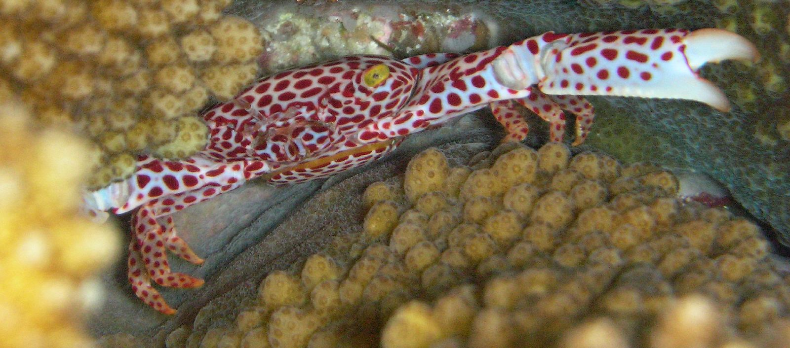

# Rusty Coral Envinronmental Sensors

[](https://en.wikipedia.org/wiki/Trapezia)

Rust drivers for the [Google Coral Environmental Sensor Board](https://coral.ai/docs/enviro-board/datasheet). Developed on a Raspberry Pi. Provides C bindings.

The crate bundles together drivers that allow readings from:
- **Humidity + Temperature**: [Texas Instruments HDC2010](https://www.ti.com/lit/ds/symlink/hdc2010.pdf) with help from [`hdc20xx`](https://crates.io/crates/hdc20xx) crate.
- **Ambient Light**: [Texas Instruments OPT3002](https://www.ti.com/lit/ds/symlink/opt3002.pdf) with help from [`opt300x`](https://crates.io/crates/opt300x) crate.
- **Barometric Pressure**: [Bosch BMP280](https://www.bosch-sensortec.com/media/boschsensortec/downloads/datasheets/bst-bmp280-ds001.pdf) with help from [`bmp280`](https://crates.io/crates/bmp280) crate.

# Usage

Simply declare `extern crate coral_env`, then call one of the four functions:
- `coral_env::temperature()`
- `coral_env::humidity()`
- `coral_env::light()`
- `coral_env::pressure()`

All functions will return a `f32` with the respective reading.
For example:
```
extern crate coral_env;

fn main() {
    println!("Temperature: {} °C", coral_env::temperature());
    println!("Humidity: {} %", coral_env::humidity());
    println!("Ambient Light: {} lux", coral_env::light());
    println!("Pressure: {} kPa", coral_env::pressure());
}
```

which generates:
```
Temperature: 41.38214 °C
Humidity: 23.078918 %
Ambient Light: 70.72 lux
Pressure: 100.26103 kPa
```

# C bindings
`Makefile` and `main.c` show how to link against `target/debug/libcoralenv.a`.

```
$ make
$ ./main 
Temperature: 37.575378 °C
Humidity: 26.179504 %
Ambient Light: 70.800003 lux
Pressure: 100.337738 kPa
```

**Warning** ⚠️

I'm a total Rust n00b. This crate is just a small experiment, and things are silly and ugly.
Real credit goes to [natemara](https://github.com/natemara) and [eldruin](https://github.com/eldruin) for their work in the original drivers.
